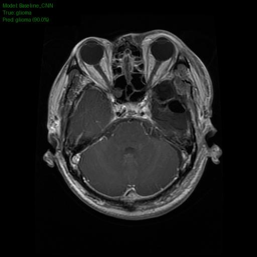
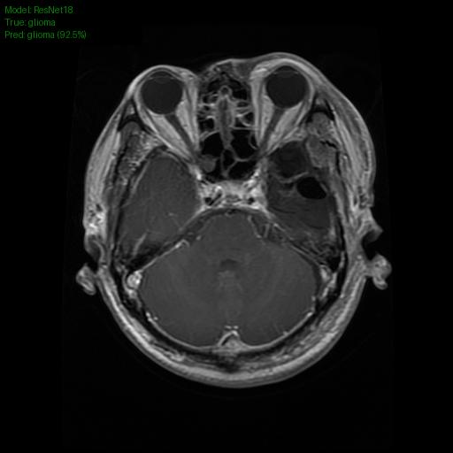

# Brain Tumor Detection

## Project Overview
Brain tumors seriously affect lives worldwide. In the US alone, nearly 700,000 people are living with a brain tumor. Early detection is critical: if tumors are detected at an early stage, the patient survival rate can jump from **5% to 90%**.

The goal of this project is to train Deep Learning models with over 90% accuracy to assist in early detection, potentially saving lives and reducing healthcare costs. This project detects brain tumors from MRI images using Convolutional Neural Networks (CNNs).

**Data Source:** [Kaggle: Brain Tumor MRI Dataset](https://www.kaggle.com/datasets/masoudnickparvar/brain-tumor-mri-dataset/data) containing 4 classes: Glioma, Meningioma, Pituitary, and No Tumor.

## Repository Structure

```text
├── README.md              # Project documentation
├── requirements.txt       # Dependencies to run main.py and demo.py
├── src/                   # Core Python source code
│   ├── main.py            # Script to prepare data, train models, save weights, and evaluate
│   ├── utils.py           # Helper functions for data handling, training, and visualization
│   └── model.py           # Architecture definitions for models
├── data/                  # Placeholder for raw data (BrainTumor.zip)
├── checkpoints/           # Saved model weights (.pth files)
├── demo/                  # Demo assets
│   ├── demo.py            # Inference script to download models and predict on sample images
│   └── *.jpg              # Sample MRI images for testing
├── results/               # Generated predictions (annotated images and text report)
└── Brain_Tumor_Detection.ipynb  # Jupyter notebook for Colab execution
````

## Setup Instructions

### 1\. Environment Setup

It is recommended to use a virtual environment to manage dependencies.

**Step 1: Create a virtual environment**

```bash
python -m venv .venv
```

**Step 2: Activate the environment**

  * **Windows:**
    ```bash
    .venv\Scripts\activate
    ```
  * **Mac/Linux:**
    ```bash
    source .venv/bin/activate
    ```

**Step 3: Install dependencies**

```bash
pip install -r requirements.txt
```

-----

## How to Run the Demo

The demo script automates the entire inference pipeline. It will:

1.  Automatically download pre-trained weights (`Baseline_CNN.pth` and `ResNet18.pth`) from Google Drive if missing.
2.  Run predictions on sample MRI images stored in the `demo/` folder.
3.  Save annotated result images and a text report to the `results/` folder.

**Command:**

```bash
python demo/demo.py
```

### Expected Output

**1. Console Output & Text Report:** You will see a prediction table printed to your terminal.

Below is an expample output:

```text
Model           | Image Name           | True Type    | Predict      | Conf  
---------------------------------------------------------------------------
ResNet18        | glioma_1.jpg         | glioma       | glioma       | 92.5%
Baseline_CNN    | glioma_1.jpg         | glioma       | glioma       | 88.6%
```
A file named `results/predictions.txt` will contain the detailed classification confidence scores.

## **2. Visual Results**
Annotated images will be generated in the `results/` folder.

The predicted class and confidence score are overlaid directly onto the MRI scans for immediate visual verification on the upper-left side of the scan.

| Input Image | Baseline CNN Prediction | ResNet18 Prediction |
| :---: | :---: | :---: |
|  <br> *Original* |  <br> *Baseline CNN* |  <br> *ResNet18* |


*(Note: The images above assume `glioma_1.jpg` exists in your demo folder and the `demo.py` has run.)*

-----

## How to Train Locally

If you wish to retrain the models from scratch:

1.  **Download Data:** Download `BrainTumor.zip` from [Kaggle](https://www.kaggle.com/datasets/masoudnickparvar/brain-tumor-mri-dataset/data) and place it inside the `data/` folder.
2.  **Run Training:**
    ```bash
    python src/main.py
    ```
      * This script will unzip the data, split it into Train (80%), Val (10%), and Test (10%).
      * It will train both the Baseline CNN and ResNet18.
      * Best weights will be saved to `checkpoints/`.
      * Comparison plots (Accuracy/Loss) will be saved to `results/`.
  
## Pre-trained Models

You can download the trained models manually via Google Drive:

  * [Download Baseline CNN (.pth)](https://drive.google.com/file/d/1uty1EA7wIoS4mL3ZSnGpAv0u0x8UaDnl/view?usp=drive_link)
  * [Download ResNet18 (.pth)](https://drive.google.com/file/d/1sIzWNmRUYPVwcXj6UimuyV_FeYRG2whj/view?usp=drive_link)

-----

## Model Design & Training Details

### 1\. Architectures

  * **Baseline CNN:** A custom 5-layer Convolutional Neural Network. The architecture is divided into four blocks: Blocks 1, 2, and 4 consist of a single Conv2D layer with BatchNorm, ReLU, and MaxPooling, while Block 3 features two stacked Conv2D layers for deeper feature extraction. The model utilizes Global Average Pooling and a two-layer fully connected classifier with Dropout regularization to output predictions for the 4 classes.
  
  * **ResNet18:** A pre-trained ResNet18 (Transfer Learning) fine-tuned on the MRI dataset. The final fully connected layer is modified to output 4 classes.

### 2\. Hyperparameters

  * **Optimizer:** Adam
  * **Learning Rate:** 0.001 (with `ReduceLROnPlateau` scheduler)
  * **Batch Size:** 32
  * **Image Size:** 224 x 224
  * **Loss Function:** CrossEntropyLoss (with Label Smoothing=0.1)
  * **Data Augmentation:** Random Horizontal Flip, Random Rotation (10°), Color Jitter (Brightness/Contrast).
  * **Epochs:** 30
  * **Early Stopping:** Patience of 7 epochs based on validation loss.

## Acknowledgments

  * Dataset provided by [Masoud Nickparvar on Kaggle](https://www.kaggle.com/datasets/masoudnickparvar/brain-tumor-mri-dataset/data).

